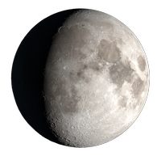
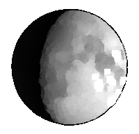
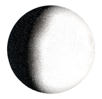
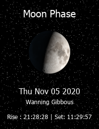
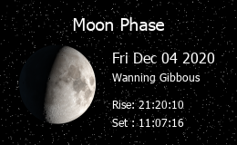

# Moon Phase



Generate Moon Phase










Basic &lt;hash&gt;





Image format to be returned. Valid values are `png` or `svg`. Defaults to `png`



Style object contains the styling parameters for the image generated.



Observer object must contain the `latitude`, `longitude` and `date` of the observer. 



View object is used to configure the view of the rendered image. The view object must contain a `type` object. 










```typescript
{
    "data": {
        "imageUrl": "https://widgets.astronomyapi.com/moon-phase/generated/1234567890.png"
    }
}
```





```typescript
{
    "format": "png",
    "style": {
        "moonStyle": "sketch",
        "backgroundStyle": "stars",
        "backgroundColor": "red",
        "headingColor": "white",
        "textColor": "red"
    },
    "observer": {
        "latitude": 6.56774,
        "longitude": 79.88956,
        "date": "2020-11-01"
    },
    "view": {
        "type": "portrait-simple"
    }
}
```

## Format

The API currently supports outputting images in `svg` and `png` formats. These can be used in different use cases, depending on how and where you want them to be displayed. 

## Style

#### `moonStyle`

Valid values are `default`, `sketch` and `shaded.` Below are sample moons for each value.







#### `backgroundStyle`

Background style supports the values either `stars` or `solid`. Passing `stars` will render a stars background while `solid` will render the background with a colid colour specified by the `backgroundColor` property.

#### `backgroundColor, headingColor and textColor`

These properties could be used to customize the image further. Colors could be defined as hex or as any of the 140 html color names.

## View

View object should specify which template to be used when rendering the image. Currently two templates are available.





