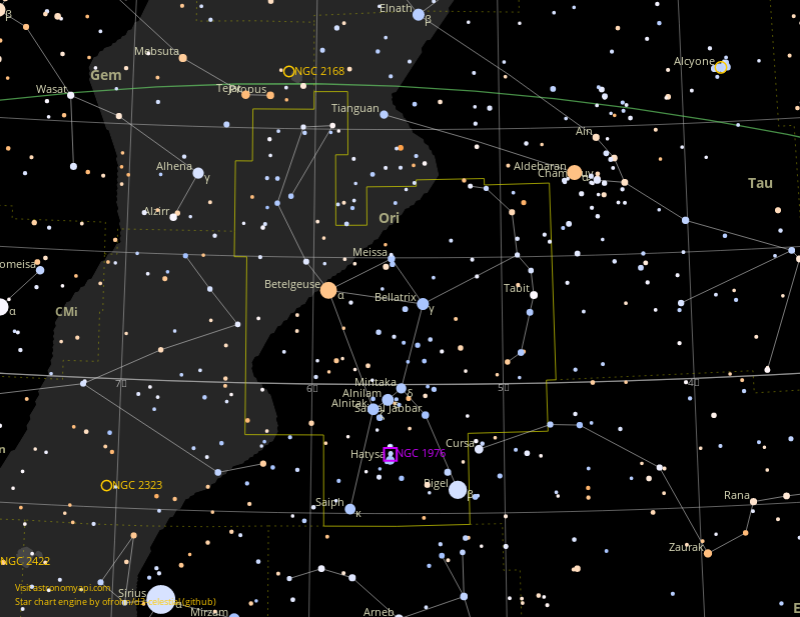
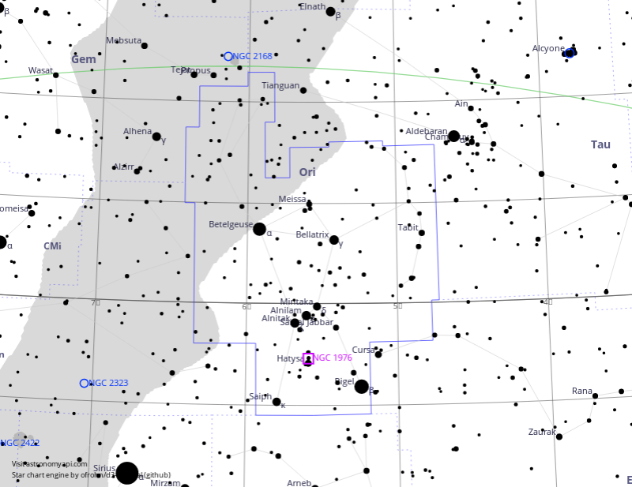
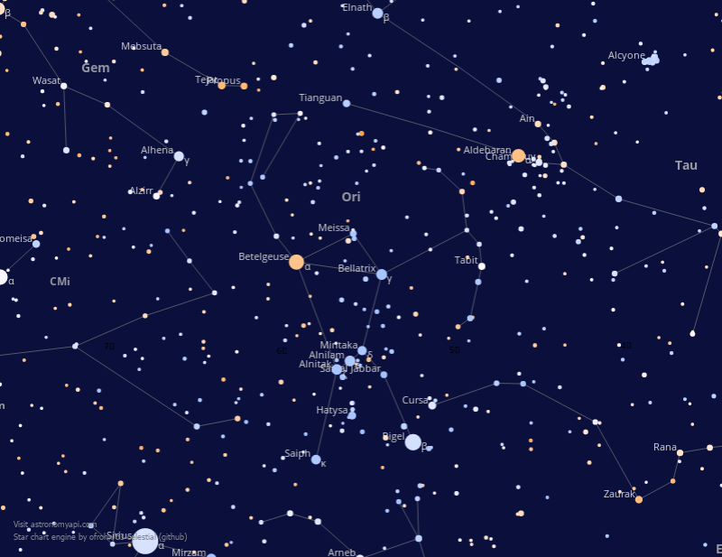
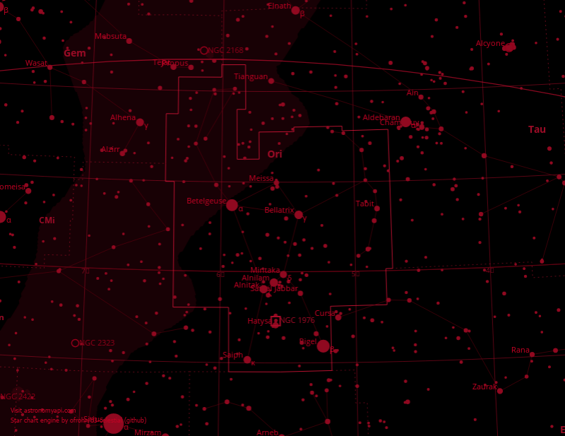

# Star Chart



Generate star chart










Basic &lt;hash&gt;





Style of the map to be generated. If not provided will use the default style. To see a demo of available styles see styles section on this page. 



Observer object must contain the `latitude`, `longitude` and `date` of the observer.



View object is used to configure the view of the rendered image. The view object must contain a `type` and `parameters` object. Parameters object can vary based on the `type`.







Cake successfully retrieved.


```typescript
{
 "data": {
     "imageUrl": "https://widgets.astronomyapi.com/star-chart/generated/1234567890.png"
  }
}
```





### Rendering different views

#### Constellation

To generate an image of a constellation the `type` in the `view` object must be set to `constellation`. The 3 letter id of the constellation must be passed in the parameters for the view object.


The 3 letter constellation id is case sensitive, only lower case is allowed


```typescript
{
    "style": "inverted",
    "observer": {
        "latitude": 33.775867,
        "longitude": -84.39733,
        "date": "2019-12-20"
    },
    "view": {
        "type": "constellation",
        "parameters": {
            "constellation": "ori" // 3 letter constellation id
        }
    }
}
```

#### Area

To generate an image of an area in the sky, set the `type` to `area`, then pass the RA and Dec values in the `position` object for the view `parameters`. Currently equatorial coordinates are supported by the API. Additionally the parameter `zoom` can be provided to scale the image, but it's optional.

```typescript
// Note how this request does not have the field `style` 
// The API will use the default style
{
    "observer": {
        "latitude": 33.775867,
        "longitude": -84.39733,
        "date": "2019-12-20"
    },
    "view": {
        "type": "area",
        "parameters": {
            "position": {
                "equatorial": {
                    "rightAscension": 14.83,
                    "declination": -15.23
                }
            },
            "zoom": 3 //optional
        }
    }
}
```

## Styles

### `default`



### `inverted`



### `navy`



### `red`




